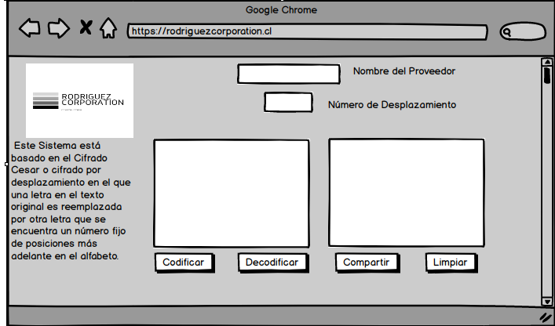
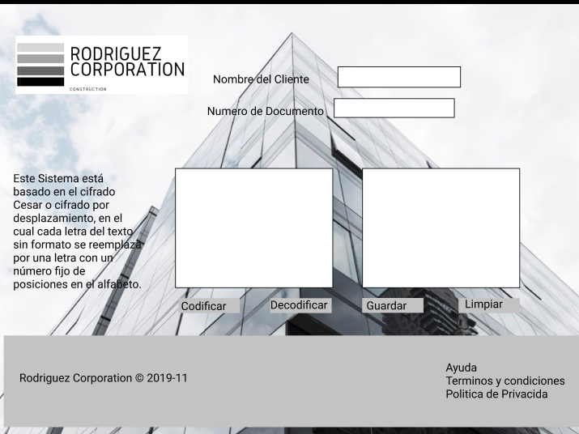

# Cifrado César

Cifrar significa codificar. El [cifrado César](https://en.wikipedia.org/wiki/Caesar_cipher) es uno de los primeros métodos de cifrado conocidos. El emperador romano Julio César lo usaba para enviar órdenes secretas a sus generales en los campos de batalla.

El cifrado césar es una de las técnicas más simples para cifrar un mensaje. Es un tipo de cifrado por sustitución, es decir que cada letra del texto original es reemplazada por otra que se encuentra un número fijo de posiciones (desplazamiento) más adelante en el mismo alfabeto.

Por ejemplo, si usamos un desplazamiento (_offset_) de 3 posiciones:

- La letra A se cifra como D.
- La palabra CASA se cifra como FDVD.
- Alfabeto sin cifrar: A B C D E F G H I J K L M N O P Q R S T U V W X Y Z
- Alfabeto cifrado: D E F G H I J K L M N O P Q R S T U V W X Y Z A B C

En la actualidad, todos los cifrados de sustitución simple se descifran con mucha facilidad y, aunque en la práctica no ofrecen mucha seguridad en la comunicación por sí mismos; el cifrado César sí puede formar parte de sistemas más complejos de codificación, como el cifrado Vigenère, e incluso tiene aplicación en el sistema ROT13.

## DEFINICION DEL PRODUCTO 🔍

Este proyecto va dirigido a empresas con amplia necesidad de resguardar algún tipo de dato, bien sea datos financieros de sus clientes, datos comerciales, cuentas por pagar, cuentas por cobrar o cualquier otra información confidencial que sea de uso interno. Su finalidad es ofrecer una plataforma segura en donde los usuarios puedan a traves del código Cesar mantener sus datos codificados.
Debido a la problematica de riesgo de fuga de información que se presentan en algunas empresas he decidido enfocar este proyecto en una constructora debido a que se manejan datos financieros importantes de los clientes los cuales siempre estan en riesgo de ser robado y ponen en peligro la confidencialidad de su información e incluso una posible estafa.

## OBJETIVO DE LOS USUARIOS 👷‍♀️

- Manejar de manera interna datos financieros confidenciales resguardando la integridad del cliente.
- Mantener protegidos datos de proveedores y cuentas por pagar.
- Poder acceder a los datos de manera rápida y segura.
- Compartir información de manera discreta y segura para ser evaluada por todos los departamentos de la empresa que lo ameriten.

## DESARROLLO DEL PRODUCTO 💡
Prototipo de baja fidelidad

Despues de haber elaborado el prototipo a mano alzada, inicie el proceso de elaboración del prototipo de media utilizando una herramienta llamada balsamiq. 

Prototipo de Media

Una vez elaborado el primer prototipo digital decidi utilizar la herramienta FIGMA para inicar la elaboración del prototipo de alta fidelidad con interacción para simular la interacción de mi producto.

Prototipo de Alta Fidelidad

[enlace al prototipo de alta fidelidad con interacción](https://www.figma.com/proto/xFLQ4y931Xp9sj1ZN8ts5R/prototipo3?node-id=5%3A3&scaling=scale-down)

